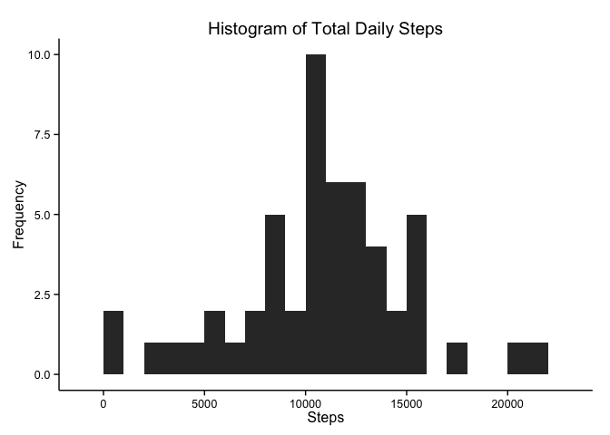
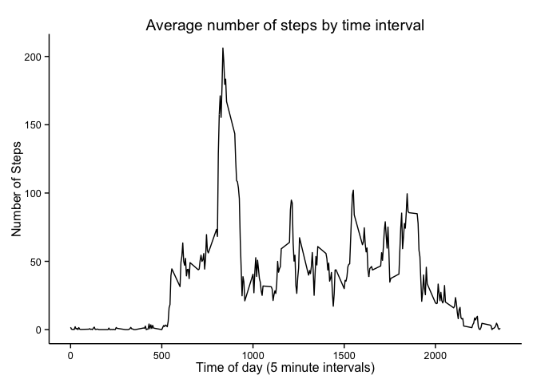
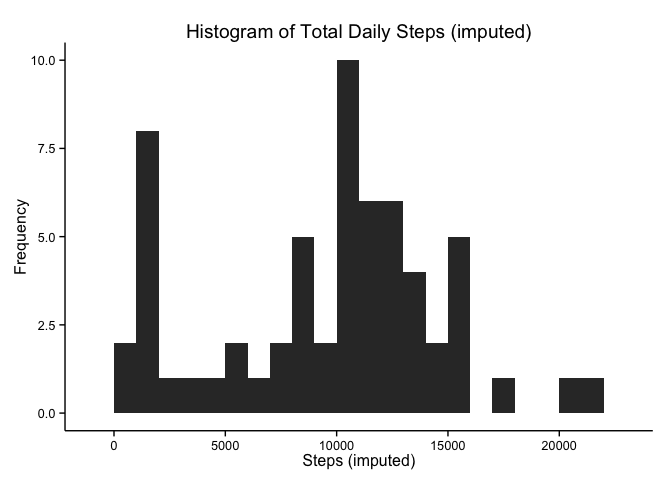
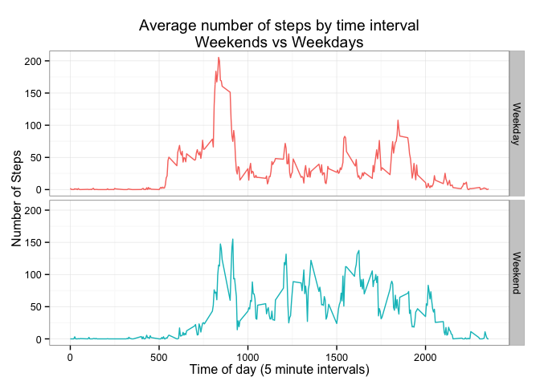

# Reproducible Research: Peer Assessment 1

## Loading and preprocessing the data
Before beginning, load up the necessary packages.

```r
if (require(ggplot2) == FALSE) install.packages("ggplot2")
```

```
## Loading required package: ggplot2
```

```r
if (require(dplyr) == FALSE) install.packages("dplyr")
```

```
## Loading required package: dplyr
## 
## Attaching package: 'dplyr'
## 
## The following object is masked from 'package:stats':
## 
##     filter
## 
## The following objects are masked from 'package:base':
## 
##     intersect, setdiff, setequal, union
```
Now, we'll just run a simple check to see if we've already unzipped our data 
and put it in the correct `data` folder. If so, we load it. Else, we unzip it 
and then load it.

After loading, display a quick summary of the dataframe.


```r
if (file.exists("./data/activity.csv")) {
    steps <- read.csv("./data/activity.csv")
} else {
    unzip("./activity.zip", exdir = "./data")
    steps <- read.csv("./data/activity.csv")
}
summary(steps)
```

```
##      steps                date          interval     
##  Min.   :  0.00   2012-10-01:  288   Min.   :   0.0  
##  1st Qu.:  0.00   2012-10-02:  288   1st Qu.: 588.8  
##  Median :  0.00   2012-10-03:  288   Median :1177.5  
##  Mean   : 37.38   2012-10-04:  288   Mean   :1177.5  
##  3rd Qu.: 12.00   2012-10-05:  288   3rd Qu.:1766.2  
##  Max.   :806.00   2012-10-06:  288   Max.   :2355.0  
##  NA's   :2304     (Other)   :15840
```

## What is mean total number of steps taken per day?

### Calculate the total number of steps taken per day

We can quickly calculate the total number of steps per day using `dplyr`. Then
display the first five rows.

```r
daily <- steps %>% 
    group_by(date) %>% 
    summarize(steps = sum(steps))
head(daily, 5)
```

```
## Source: local data frame [5 x 2]
## 
##         date steps
## 1 2012-10-01    NA
## 2 2012-10-02   126
## 3 2012-10-03 11352
## 4 2012-10-04 12116
## 5 2012-10-05 13294
```

### Make a histogram of the total number of steps taken each day
We can use `ggplot2` to quickly create a histogram of total daily steps.

```r
ggplot(data = daily, aes(x = steps)) + 
    geom_histogram(binwidth = 1000) + 
    labs(x = "Steps", y = "Frequency", 
         title = "Histogram of Total Daily Steps") + 
    theme_classic()
```



### Calculate and report the mean and median of the total number of steps taken per day

In addition to mean and median, `summary()` provides key numbers. Below, we see 
that the mean is `10770` and the median is `10760`.

```r
summary(daily$steps)
```

```
##    Min. 1st Qu.  Median    Mean 3rd Qu.    Max.    NA's 
##      41    8841   10760   10770   13290   21190       8
```

## What is the average daily activity pattern?

### Make a time series plot (i.e. ```type = "l"```) of the 5-minute interval (x-axis) and the average number of steps taken, averaged across all days (y-axis)

```r
intervals <- steps %>% 
    group_by(interval) %>% 
    summarize(steps = mean(steps, na.rm = TRUE))

ggplot(data = intervals, aes(y = steps, x = interval)) + 
    geom_line() + 
    labs(x = "Time of day (5 minute intervals)", y = "Number of Steps", 
          title = "Average number of steps by time interval") + 
    theme_classic()
```



### Which 5-minute interval, on average across all the days in the dataset, contains the maximum number of steps?

From the plot above, it looks like the maximum number of steps occurs during a 
time interval around 800. In fact, the `835` interval has the maximum as shown:

```r
intervals[intervals$steps == max(intervals$steps), ]
```

```
## Source: local data frame [1 x 2]
## 
##   interval    steps
## 1      835 206.1698
```

## Imputing missing values

### Calculate and report the total number of missing values in the dataset (i.e. the total number of rows with `NA`s)

From the summary of the datafrane above, we know that the number of missing rows is `2304`.
 We can confirm this:

```r
sum(is.na(steps$steps))
```

```
## [1] 2304
```

### Devise a strategy for filling in all of the missing values in the dataset. The strategy does not need to be sophisticated. For example, you could use the mean/median for that day, or the mean for that 5-minute interval, etc.

From the plots above, it looks like the number of steps is much more dependent 
on the time interval than on the day. Thus, for all missing values, I will 
impute the median value for that same time interval (across all days).

### Create a new dataset that is equal to the original dataset but with the missing data filled in.


```r
medsteps <- steps %>%
    group_by(interval) %>% 
    summarize(steps = median(steps, na.rm = TRUE))

steps$imputed <- ifelse(is.na(steps$steps), medsteps$steps, steps$steps)
```

### Make a histogram of the total number of steps taken each day and Calculate and report the **mean** and **median** total number of steps taken per day. Do these values differ from the estimates from the first part of the assignment? What is the impact of imputing missing data on the estimates of the total daily number of steps?


```r
imputeddaily <- steps %>% 
    group_by(date) %>% 
    summarize(steps = sum(imputed))

ggplot(data = imputeddaily, aes(x = steps)) + 
    geom_histogram(binwidth = 1000) + 
    labs(x = "Steps (imputed)", y = "Frequency", 
         title = "Histogram of Total Daily Steps (imputed)") + 
    theme_classic()
```



```r
summary(daily$steps)
```

```
##    Min. 1st Qu.  Median    Mean 3rd Qu.    Max.    NA's 
##      41    8841   10760   10770   13290   21190       8
```

```r
summary(imputeddaily$steps)
```

```
##    Min. 1st Qu.  Median    Mean 3rd Qu.    Max. 
##      41    6778   10400    9504   12810   21190
```

The mean and median for the imputed dataset are `10770` and `10760`, respectively. As we can see from above, imputation slightly alters the results. Imputation results in lowering all quantiles and the median (compared to just ignoring missing values).

## Are there differences in activity patterns between weekdays and weekends?

### For this part the `weekdays()` function may be of some help here. Use the dataset with the filled-in missing values for this part.

```r
steps$wday <- weekdays(as.Date(steps$date))
```

### Create a new factor variable in the dataset with two levels – “weekday” and “weekend” indicating whether a given date is a weekday or weekend day.

```r
steps$day <- ifelse(steps$wday == "Saturday" | steps$wday == "Sunday", 
                    "Weekend", "Weekday")
```

### Make a panel plot containing a time series plot (i.e. ```type = "l"```) of the 5-minute interval (x-axis) and the average number of steps taken, averaged across all weekday days or weekend days (y-axis). See the README file in the GitHub repository to see an example of what this plot should look like using simulated data.

```r
intervalsday <- steps %>% 
    group_by(interval, day) %>% 
    summarize(steps = mean(imputed, na.rm = TRUE))

ggplot(data = intervalsday, 
       aes(y = steps, x = interval, group = day, color = day)) + 
    geom_line() + 
    labs(x = "Time of day (5 minute intervals)", y = "Number of Steps", 
          title = "Average number of steps by time interval\nWeekends vs Weekdays") + 
    theme_bw() + facet_grid(day ~ .) + 
    theme(legend.position = "none")
```




